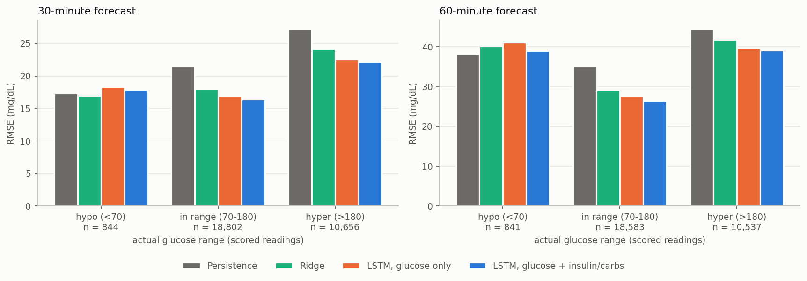
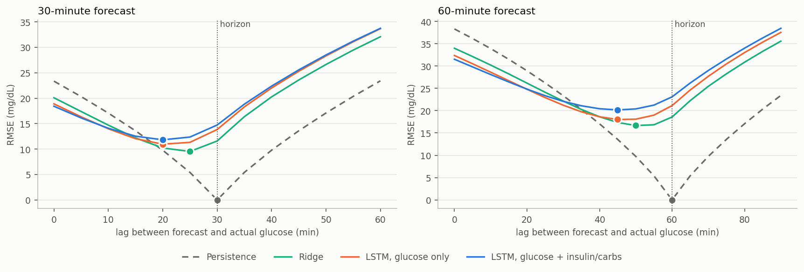
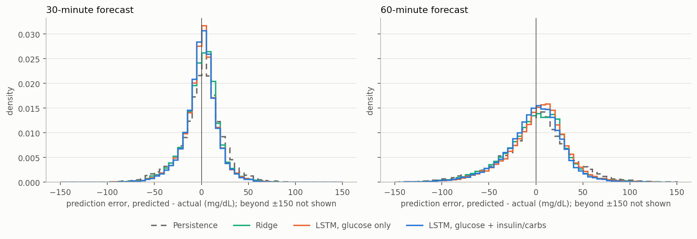

# Blood glucose forecasting on OhioT1DM

Forecast a Type 1 diabetes patient's continuous-glucose-monitor (CGM) reading **30 and 60 minutes ahead** from the last hour of CGM data plus insulin and carbohydrate history, using the OhioT1DM dataset. It reports the metric of the OhioT1DM Blood Glucose Level Prediction (BGLP) Challenge (RMSE in mg/dL, mean of per-patient RMSE) so results can be set beside the published literature, with two documented differences from the official protocol (see [Comparability](#comparability-with-the-official-bglp-rules)). The point of the repository is a **leak-free, reproducible evaluation protocol**; model sophistication is secondary.

**Headline.** On the 2020 cohort (6 patients), a small LSTM trained on glucose plus insulin and carbohydrate history reaches 18.64 ± 2.55 mg/dL RMSE at 30 min and 32.40 ± 4.47 at 60 min (mean of per-patient RMSE), against 24.22 / 40.34 for persistence and 20.20 / 35.15 for ridge regression. The same LSTM on glucose alone reaches 19.26 / 33.83; over all 12 patients the two LSTMs reach 19.03 / 32.57 (glucose only) and 18.56 / 31.70 (with insulin/carbs). The main limitation is that the models' point forecasts **rarely fall below 70 mg/dL, so they cannot flag hypoglycemia at the standard threshold, and at 60 minutes they essentially never do** (see [Main limitation](#43-main-limitation-the-point-forecasts-rarely-cross-the-hypoglycemia-threshold)).

**Intended use.** This is a candidate forecasting component for a diabetes-management app; it is a research prototype and has **not been clinically validated**.

---

## 1. Data and handling rules

OhioT1DM (Marling & Bunescu, 2020) has two cohorts of 6 patients each (2018 release: 559, 563, 570, 575, 588, 591; 2020 release: 540, 544, 552, 567, 584, 596). Each patient has an ~8-week training file and a test file covering roughly the final 10 days, chronologically after the training file. The dataset is distributed under a **Data Use Agreement**:

- Raw data is gitignored (`data/`) and is never committed or published.
- Everything published here is aggregate: counts, error metrics and aggregate figures. **No raw patient trace is published**, including per-patient prediction traces.
- The data root is a config field (`paths.data_root`); no absolute path is hardcoded.

To reproduce, obtain the dataset yourself and place the XML files under `data/raw/<year>/{train,test}/`.

## 2. Method

### 2.1 Preprocessing decisions

Each patient file becomes a regular 5-minute grid with columns `glucose`, `glucose_observed`, `bolus`, `basal`, `carbs`.

| Decision | Choice | Why |
|---|---|---|
| Time alignment | Every stream snapped to the **nearest** 5-min bin; on a collision the earlier CGM reading is kept | A bolus, a meal and a CGM reading from the same moment share a bin. The whole dataset had 1 collision. |
| Missing glucose | **Causal forward-fill of at most 6 bins (30 min)**, identical for train, validation and test; longer gaps stay missing | Linear interpolation uses readings *after* a gap, so bins near a window's end would encode future information, and the model would train on a fill pattern it never sees at test time. This tightens the original plan, which allowed interpolation for training data. |
| Imputed values are flagged | `glucose_observed` (1 = real reading, 0 = forward-filled) is always a model input | The model can tell measured values from carried-forward ones. |
| Scored targets | A window is only used if its **target is a real CGM reading** | Never score against an imputed value. |
| Insulin and carbs | Event streams: absence means 0, never interpolated. Extended boluses are spread uniformly over their duration; basal is rate/12 per bin with temp basals overriding it (0 = pump suspended) | Matches how the pump delivers. |
| Unknown basal at the start of a test file | Seeded from the same patient's **last training basal rate** | Causal, because training strictly precedes testing. A few test files have no basal event for hours or days (patient 588: 3 days). |
| Carbohydrates | `meal.carbs` only, all meal types | `bolus.bwz_carb_input` exists only in the 2018 release, so it cannot be used consistently across cohorts. |
| Events outside the CGM span | Dropped and counted in `results/data_quality.csv` | They cannot be placed on the grid. |
| Wearables, sleep, exercise, stress | **Not used** | Sensors differ between cohorts and self-reports are sparse. |

### 2.2 Windows and splits

- **Input:** the last 12 steps (60 min). **Target:** glucose 6 steps (30 min) or 12 steps (60 min) after the last input. One model per horizon.
- **A window is rejected** if its target is not a real reading, if any input glucose is still missing after the forward-fill, or if more than 25% of its input bins are forward-filled. The same rules apply in train, validation and test.
- **Split:** each patient's training file is cut **chronologically**, last 20% for validation. Windows are built *inside* each segment, so no window straddles the cut: the 17 (30 min) or 23 (60 min) windows per patient that would have straddled it are dropped. Glucose is re-filled inside each segment so no validation reading fills a training bin. Nothing is shuffled before the split.
- **Scaling:** statistics fit on training data only and saved with each checkpoint.
- **Windows kept** (30 min): 103,309 train, 25,729 validation, 30,302 test. At 60 min: 102,261 / 25,379 / 29,961.

### 2.3 Evaluation protocol

- One **population** model per horizon, trained on all 12 patients' training data and evaluated per patient on that patient's test file.
- **No model or hyperparameter choice was made using test data.** Every hyperparameter that is chosen at all (ridge penalty, extrapolation length, early stopping) is chosen on validation, and the LSTM configuration was not tuned. The test files were scored after those choices were fixed.
- **Same windows for every model.** Each run's test windows are hashed and checked against the baselines' hash before scoring; a mismatch raises an error.
- **Metrics:** RMSE and MAE in mg/dL, computed per patient, then reported as mean ± std across patients (sample std, ddof = 1). Persistence is in every table.
- **Coverage:** 95.5% (30,302 of 31,743) of real test CGM readings are scored at 30 min and 94.4% at 60 min; the rest lack a full clean input window. Per patient: `results/test_coverage.csv`.
- **Seeds:** the LSTMs are trained with seeds 0-4 and reported as mean ± std across seeds and across patients. Per-patient results are averaged over seeds.

### 2.4 Models

| Model | Notes |
|---|---|
| Persistence | Last observed glucose value. |
| Linear extrapolation | Slope over the last k readings (k = 6, the largest of {2, 3, 4, 6}, chosen on validation), extrapolated forward. |
| Ridge | On the flattened window; penalty chosen on validation. |
| LSTM (Hochreiter & Schmidhuber, 1997) | 2 layers, hidden size 64, dropout 0.2, final hidden state → linear head. MSE loss, Adam (1e-3), gradient clipping, early stopping on validation RMSE (patience 10) with best-weights restore. Trained twice: on glucose only, and on glucose + insulin + carbs. |

A Transformer (optional in the plan) was **not implemented**.

## 3. Reproducing

```bash
pip install -r requirements.txt
python -m src.data.preprocess --config configs/base.yaml      # caches 5-min grids
python -m src.data.explore    --config configs/base.yaml      # data-quality report
python -m src.models.baselines --config configs/base.yaml     # baselines, both horizons
python -m src.run_seeds --configs configs/lstm_ph30.yaml configs/lstm_ph60.yaml \
        configs/lstm_ins_ph30.yaml configs/lstm_ins_ph60.yaml --seeds 0 1 2 3 4
python -m src.evaluate --config configs/base.yaml             # rebuild comparison tables
python -m src.analysis --config configs/base.yaml             # range / lag / Clarke / figures
python -m pytest                                              # 104 tests
```

Single runs: `python -m src.train --config configs/lstm_ph30.yaml --seed 0`, then `python -m src.evaluate --config configs/lstm_ph30.yaml --checkpoint checkpoints/lstm_ph30_seed0.pt`.

The tests cover parsing, grid alignment, the gap policy, the leakage rules (target exactly one horizon after the last input, no input at or after the target, no window across the split, scaler fit on training only), rejection rules, the same-windows check, and the aggregation and analysis code, with hand-computed expected values. The leakage tests were checked by deliberately breaking the code (interpolation, backward fill, fill before the split) and confirming they fail.

---

## 4. Results

All numbers are RMSE / MAE in **mg/dL**, on the test files. "±" is the standard deviation across patients of each patient's (seed-averaged) error. **These numbers are not directly comparable with published BGLP results**: two specific differences from the official protocol are listed under [Comparability](#comparability-with-the-official-bglp-rules) below.

### 4.1 Headline results

**2020 cohort** (540, 544, 552, 567, 584, 596), the cohort BGLP papers report on:

| Model | 30 min RMSE | 30 min MAE | 60 min RMSE | 60 min MAE |
|---|---|---|---|---|
| Persistence | 24.22 ± 3.26 | 17.57 ± 2.46 | 40.34 ± 5.57 | 29.79 ± 4.34 |
| Linear extrapolation (k=6) | 27.26 ± 3.50 | 18.87 ± 2.62 | 56.63 ± 8.19 | 40.05 ± 6.13 |
| Ridge (α=10) | 20.20 ± 2.51 | 14.74 ± 1.81 | 35.15 ± 4.70 | 26.64 ± 3.47 |
| LSTM, glucose only | 19.26 ± 2.50 | 13.80 ± 1.77 | 33.83 ± 4.57 | 25.32 ± 3.38 |
| LSTM, glucose + insulin/carbs | 18.64 ± 2.55 | 13.38 ± 1.79 | 32.40 ± 4.47 | 24.21 ± 3.25 |

**All 12 patients:**

| Model | 30 min RMSE | 30 min MAE | 60 min RMSE | 60 min MAE |
|---|---|---|---|---|
| Persistence | 23.40 ± 2.91 | 16.96 ± 2.07 | 38.44 ± 4.79 | 28.53 ± 3.51 |
| Linear extrapolation (k=6) | 27.33 ± 4.05 | 18.51 ± 2.48 | 55.32 ± 7.92 | 38.62 ± 5.51 |
| Ridge (α=10) | 20.23 ± 2.35 | 14.48 ± 1.54 | 34.22 ± 3.73 | 25.76 ± 2.88 |
| LSTM, glucose only | 19.03 ± 2.11 | 13.47 ± 1.49 | 32.57 ± 3.65 | 24.21 ± 2.79 |
| LSTM, glucose + insulin/carbs | 18.56 ± 2.18 | 13.13 ± 1.47 | 31.70 ± 3.47 | 23.50 ± 2.61 |

Across the five seeds, the cross-patient mean RMSE of each LSTM varies by only 0.04-0.13 mg/dL, far below the gaps between models. Per-patient tables are in `results/comparison_per_patient.csv`; all summaries in `results/comparison_summary.csv`. The glucose-only LSTM beats ridge and persistence for every one of the 12 patients at both horizons.

#### Comparability with the official BGLP rules

The official BGLP evaluation rules (<https://webpages.charlotte.edu/rbunescu/data/ohiot1dm/bglp/bglp-rules.html>) apply to the 2020 cohort. Where our pipeline can be checked against them it complies: **no interpolation anywhere** (missing glucose is handled by causal forward-fill, i.e. extrapolation, which the rules allow; interpolation is forbidden), results reported on the **2020 cohort**, and the headline metric is the **mean of per-patient RMSE** (and MAE) at 30 and 60 minutes. Two differences remain, and both mean the numbers above should not be set directly beside published ones:

**1. We score fewer test points than the challenge.** The rules start the evaluation points 60 minutes after the start of each test file and score the test points from there. The official counts equal our number of real CGM readings in each test file minus the first 12 (60 minutes), for all six patients, so our parsing reproduces the official reading counts exactly. But we also drop windows whose input contains a gap the forward-fill does not cover (or more than 25% forward-filled bins), so we score a subset:

| Patient | Official scored points | Real CGM readings in our test file | Ours scored, 30 min | Ours scored, 60 min | Ours as % of official (30 / 60 min) |
|---|---|---|---|---|---|
| 540 | 2,884 | 2,896 | 2,773 | 2,753 | 96.2% / 95.5% |
| 544 | 2,704 | 2,716 | 2,639 | 2,615 | 97.6% / 96.7% |
| 552 | 2,352 | 2,364 | 2,234 | 2,195 | 95.0% / 93.3% |
| 567 | 2,377 | 2,389 | 2,200 | 2,143 | 92.6% / 90.2% |
| 584 | 2,653 | 2,665 | 2,435 | 2,408 | 91.8% / 90.8% |
| 596 | 2,731 | 2,743 | 2,624 | 2,597 | 96.1% / 95.1% |
| **All six** | **15,701** | **15,773** | **14,905** | **14,711** | **94.9% / 93.7%** |

Our scored set is 90.2%-97.6% of the official set per patient. **We have not measured how the models score on the points we drop**, so the effect on RMSE could go either way; the omitted points are those whose preceding hour contains a substantial CGM gap (a run the 30-minute forward-fill cannot cover, or shorter gaps that leave more than 25% of the input forward-filled).

**2. Our model does not follow the rules' offline definition.** The rules describe an offline model as one model per patient, trained and tuned on the provided training data (pre-training on the 2018 cohort is allowed). Ours is a **single population model**: one set of weights trained on all 12 patients' training data and then evaluated per patient, with **no per-patient training or fine-tuning**. Matching the official definition would require one model per patient (optionally pre-trained on the 2018 cohort), which is listed under future work.

#### Published BGLP 2020 results, for context

Two entries from the 2020 challenge, both on the 2020 cohort:

| System | Approach | 30 min RMSE | 60 min RMSE | Reference |
|---|---|---|---|---|
| Bevan & Coenen (2020) | Single non-personalized LSTM (1 layer, 128 hidden units, 30-min history), glucose only | 18.23 ± 2.36 | 31.10 ± 4.05 | [paper17] |
| Rubin-Falcone, Fox & Wiens (2020) | Residual (N-BEATS-style) forecasting with LSTM blocks; pre-trained on Tidepool + 2018 data, fine-tuned per participant | 18.22 | 31.66 | [paper18] |
| **This repo** (LSTM + insulin/carbs) | Single population model, untuned | **18.64 ± 2.55** | **32.40 ± 4.47** | — |

Read with the caveats in [Comparability](#comparability-with-the-official-bglp-rules): both published systems score every official test point, while we score 94.9% (30 min) and 93.7% (60 min) of them, and, unlike Rubin-Falcone et al., we do not train or fine-tune per patient. Bevan & Coenen's system is the closest in kind, since it is also a single model shared across patients.

### 4.2 Does insulin and carbohydrate history help?

The same LSTM trained with insulin and carbs added as inputs, compared with the glucose-only LSTM. Δ RMSE is insulin/carbs minus glucose-only, so **negative means it helps**; "improved" counts patients whose seed-averaged RMSE is lower.

| Horizon | Cohort | Patients improved (seed-averaged) | Mean Δ RMSE (mg/dL) | Patients improved, seed by seed |
|---|---|---|---|---|
| 30 min | All 12 | **11 / 12** | -0.47 | 12, 8, 10, 12, 11 |
| 30 min | 2020 (6) | **6 / 6** | -0.62 | 6, 5, 6, 6, 6 |
| 30 min | 2018 (6) | **5 / 6** | -0.33 | 6, 3, 4, 6, 5 |
| 60 min | All 12 | **9 / 12** | -0.87 | 9, 10, 9, 9, 10 |
| 60 min | 2020 (6) | **6 / 6** | -1.44 | 6, 6, 6, 6, 6 |
| 60 min | 2018 (6) | **3 / 6** | -0.31 | 3, 4, 3, 3, 4 |

- At 30 min, 11 of 12 patients improve; at 60 min, 9 of 12. Every 2020 patient improves at both horizons.
- The average gain is modest (about 2.5% of RMSE) but far outside the seed-to-seed variation.
- Single-seed counts are unstable (at 30 min, from 8 to 12 of 12 depending on the seed), which is why the seed-averaged count is the one to quote.
- As a **descriptive guide** to strength (not a formal test, and with no correction for looking at several cohorts and horizons), an exact two-sided sign test on these counts gives p ≈ 0.006 for 11 of 12 and p ≈ 0.15 for 9 of 12. The 60-min all-patient result is therefore not decisive by itself; it rests mostly on the 2020 cohort.
- The patients that do not improve are all from the 2018 cohort (563 at both horizons; also 575 and 591 at 60 min).
- Patient 567's test file contains no meal records, yet it improves at both horizons, so at least part of the benefit comes from insulin. The two are not separated in this experiment.

For context, **logging density** (events per day, from `results/data_quality.csv`; per-patient values next to each Δ RMSE in `results/ablation_per_patient.csv`), reported descriptively with no inference drawn:

| Cohort | Meals/day (train file) | Meals/day (test file) | Boluses/day (train file) | Boluses/day (test file) |
|---|---|---|---|---|
| 2018 (median of 6) | 4.2 | 3.5 | 5.0 | 4.6 |
| 2020 (median of 6) | 2.0 | 2.4 | 6.2 | 5.3 |

### 4.3 Main limitation: the point forecasts rarely cross the hypoglycemia threshold

The LSTMs beat persistence on overall RMSE (Section 4.1), and their forecasts are calibrated in size and direction (below). But their point forecasts seldom fall below 70 mg/dL, so **they cannot flag lows at the standard threshold, and at 60 minutes they essentially never do.**

**Hypoglycemia detection.** The event is an actual glucose below 70 mg/dL (844 scored readings at 30 min, 841 at 60 min). An alert is raised when the forecast is below the threshold in the second column. Each cell is sensitivity / precision (number of alerts): sensitivity is the share of actual lows that were alerted, precision the share of alerts that were actual lows. Pooled over all 12 patients; LSTMs are seed-averaged. For persistence the forecast is simply the last reading.

| Horizon | Alert if forecast is below | Persistence | Ridge | LSTM glucose | LSTM + insulin/carbs |
|---|---|---|---|---|---|
| 30 min | 70 mg/dL | 0.56 / 0.57 (830) | 0.38 / 0.61 (524) | 0.26 / 0.69 (318) | 0.31 / 0.73 (365) |
| 30 min | 80 mg/dL | 0.78 / 0.37 (1,760) | 0.75 / 0.51 (1,240) | 0.75 / 0.53 (1,184) | 0.76 / 0.53 (1,225) |
| 30 min | 90 mg/dL | 0.91 / 0.25 (3,019) | 0.93 / 0.32 (2,419) | 0.92 / 0.30 (2,578) | 0.92 / 0.30 (2,562) |
| 60 min | 70 mg/dL | 0.34 / 0.35 (816) | 0.04 / 0.27 (134) | 0.00 / 0.00 (0) | 0.00 / 0.25 (5) |
| 60 min | 80 mg/dL | 0.51 / 0.25 (1,743) | 0.14 / 0.26 (448) | 0.01 / 0.36 (23) | 0.05 / 0.44 (107) |
| 60 min | 90 mg/dL | 0.65 / 0.18 (2,982) | 0.46 / 0.32 (1,206) | 0.32 / 0.36 (741) | 0.41 / 0.36 (962) |

- **At the standard threshold (below 70), the models flag far fewer lows than persistence.** At 30 min sensitivity is 0.26-0.38 for the trained models against 0.56 for persistence, with higher precision (0.61-0.73 against 0.57). At 60 min, against 841 actual lows, the glucose-only LSTM raises 0.2 alerts and the insulin/carbs LSTM 4.8 (averages over the five seeds); persistence catches 34%.
- **Raising the alert threshold trades precision for sensitivity for every model.** At 30 min, alerting below 80 gives the LSTMs sensitivity 0.75-0.76 (persistence 0.78) with precision 0.53 (persistence 0.37). At 60 min, even alerting below 90 leaves LSTM sensitivity (0.32-0.41) below persistence's (0.65), at about twice its precision (0.36 against 0.18).
- **These thresholds are illustrative, not tuned.** They were evaluated on the test files; choosing an alert threshold would have to be done on validation data. About 67% of the 844 lows come from four patients (540, 567, 575, 591; see the reading counts below).

**Why the point forecasts rarely dip below 70: an explanation, not a tested result.** A model trained to minimise mean squared error learns a conditional mean, and a conditional mean is less spread out than the quantity it predicts. A low is rarely more likely than not, so the mean forecast seldom goes below 70. Persistence is a real past reading, so it keeps the full spread of glucose. The measurements agree with this: the standard deviation of the LSTM forecasts is 56.6-57.1 mg/dL at 30 min and 50.1-50.4 at 60 min, against 60.5 for actual glucose (persistence: 60.3), and 1.0-1.2% (30 min) and 0.0% (60 min) of LSTM forecasts fall below 70, against 2.8% of actual values (persistence: 2.7%). But no experiment here changes the loss, so the mechanism itself is untested. Rubin-Falcone et al. (2020) report an analogous result: in an event-based analysis restricted to the onset of hypo- and hyperglycemic events, their proposed model and their baseline perform comparably in the hypoglycemic range, which they attribute to the rarity of hypoglycemic events or to the MSE loss over-emphasizing large values.

**Calibration of changes.** Regressing the actual change (actual minus last reading) on the predicted change (forecast minus last reading) gives a slope of 1 if a predicted change of *d* mg/dL is followed, on average, by an actual change of *d*:

| Model | 30 min: slope (intercept, mg/dL) | 60 min: slope (intercept, mg/dL) |
|---|---|---|
| Ridge | 1.02 (+0.6) | 0.96 (+1.4) |
| LSTM glucose | 1.00 (+0.2) | 0.98 (+0.7) |
| LSTM + insulin/carbs | 0.98 (+0.3) | 0.96 (+1.4) |

Slopes are 0.96-1.02 with intercepts within about 1.5 mg/dL, so the forecasts are calibrated in size. The direction of large moves (actual changes of at least 10 mg/dL) is right 73-80% of the time (table below). Persistence predicts no change, so it has no slope.

**Error by glycemic range.** Split by the **actual** glucose range, the LSTMs improve on persistence in the in-range and high ranges but not in hypoglycemia:

| Horizon | Actual range | Scored readings | Persistence | Ridge | LSTM glucose | LSTM + insulin/carbs |
|---|---|---|---|---|---|---|
| 30 min | hypo (<70) | 844 | 17.3 | 17.0 | 18.4 | 17.9 |
| 30 min | in range (70–180) | 18,802 | 21.5 | 18.0 | 16.9 | 16.4 |
| 30 min | hyper (>180) | 10,656 | 27.2 | 24.1 | 22.6 | 22.2 |
| 60 min | hypo (<70) | 841 | 38.3 | 40.1 | 41.0 | 38.9 |
| 60 min | in range (70–180) | 18,583 | 35.0 | 29.1 | 27.6 | 26.5 |
| 60 min | hyper (>180) | 10,537 | 44.4 | 41.7 | 39.6 | 39.1 |

RMSE in mg/dL, all patients pooled (so patients with more readings weigh more; this differs from the patient-averaged tables above). LSTMs are seed-averaged. Scored-reading counts are shown because the hypoglycemic range is small.

Mean error (predicted − actual), mg/dL:

| Horizon | Actual range | Scored readings | Persistence | LSTM glucose | LSTM + insulin/carbs |
|---|---|---|---|---|---|
| 30 min | hypo (<70) | 844 | +9.4 | +15.3 | +14.6 |
| 30 min | in range (70–180) | 18,802 | +2.5 | +2.8 | +3.0 |
| 30 min | hyper (>180) | 10,656 | -5.4 | -6.7 | -7.2 |
| 60 min | hypo (<70) | 841 | +25.4 | +37.4 | +35.2 |
| 60 min | in range (70–180) | 18,583 | +6.7 | +8.7 | +7.4 |
| 60 min | hyper (>180) | 10,537 | -14.4 | -20.5 | -20.2 |

**A caution on reading this table.** Splitting windows by the *actual* value produces errors toward the middle for *any* forecaster, even a perfectly calibrated one: among the readings that turn out to be low, a forecast with any uncertainty will on average sit above them, and among those that turn out to be high, below them (a selection effect from conditioning on the outcome). One-sided errors like these are therefore expected in part however the model was trained, and this is also why persistence shows a positive bias in hypoglycemia. The by-range tables show *where* the errors are, not by themselves *why*.



**Lag analysis.** The figure compares each forecast for time *T* with the actual glucose at *T − lag*; a repeat-last-value forecast matches best at a lag equal to the horizon, a perfect forecast at zero.



| Horizon | Model | Best-matching lag | Direction right on large moves |
|---|---|---|---|
| 30 min | Persistence | 30 min (= the horizon, by construction) | n/a |
| 30 min | Ridge | 25 min | 76% |
| 30 min | LSTM glucose | 20 min | 79% |
| 30 min | LSTM + insulin/carbs | 20 min | 80% |
| 60 min | Persistence | 60 min (= the horizon, by construction) | n/a |
| 60 min | Ridge | 50 min | 69% |
| 60 min | LSTM glucose | 45 min | 73% |
| 60 min | LSTM + insulin/carbs | 45 min | 75% |

The best-matching lag is on the 5-minute grid; "large moves" are actual changes of at least 10 mg/dL (persistence is not scored on direction because it predicts no change). The LSTMs match the actual trace about 10 min (30-min horizon) and 15 min (60-min horizon) earlier than persistence would. **This should not be read as evidence that the models are timid:** a conditional-mean forecast of a noisy signal also looks delayed and smoothed relative to it, whatever the model's calibration.

For illustration only: in one 8-hour stretch of one test file (a raw CGM trace, so **not published here** under the Data Use Agreement), persistence looks like a copy of the actual trace shifted by the horizon. The LSTM forecasts move earlier than persistence but are visibly more jittery than the CGM trace, and at 60 min they miss the level of the actual trace by tens of mg/dL at times. This is a single stretch, not evidence.

**Clarke error grid** (Clarke et al., 1987). The share of scored readings in each Clarke zone (higher A + B is safer; zone D is "failure to detect", which includes missed hypoglycemia):

| Horizon | Model | A | B | C | D | E | A + B |
|---|---|---|---|---|---|---|---|
| 30 min | Persistence | 83.4 | 15.6 | 0.0 | 1.0 | 0.0 | 99.0 |
| 30 min | Ridge | 88.0 | 10.7 | 0.0 | 1.3 | 0.0 | 98.7 |
| 30 min | LSTM glucose | 89.2 | 9.3 | 0.0 | 1.4 | 0.0 | 98.5 |
| 30 min | LSTM + insulin/carbs | 89.9 | 8.8 | 0.0 | 1.3 | 0.0 | 98.7 |
| 60 min | Persistence | 64.7 | 32.2 | 0.6 | 2.4 | 0.1 | 96.9 |
| 60 min | Ridge | 67.3 | 29.0 | 0.3 | 3.4 | 0.0 | 96.3 |
| 60 min | LSTM glucose | 70.1 | 26.1 | 0.2 | 3.5 | 0.0 | 96.3 |
| 60 min | LSTM + insulin/carbs | 71.4 | 25.0 | 0.2 | 3.5 | 0.0 | 96.4 |

Zone assignment was cross-checked against an independent implementation (the `clarke_error_grid` package): the two agree on every one of 300,000 random continuous points, and differ only for points lying exactly on a boundary line; on our test windows this changes zone percentages by at most 0.16 percentage points, and only for persistence. It was not checked against Clarke's original paper. The models put more readings in zone A than persistence, but also slightly more in zone D, consistent with the detection results above; persistence has marginally higher A + B at both horizons. Rubin-Falcone et al. (2020) report Clarke results at the 30-minute horizon of about 99% in A + B, 90% in A and 1% in D, close to our 30-minute LSTM results (A + B 98.5-98.7%, A 89.2-89.9%, D 1.3-1.4%).



**Reading counts matter.** Hypoglycemic readings are about 3% of scored readings. In 5 of 12 patients' test files there are fewer than 30 of them (as few as 3), so patient-level hypoglycemia errors are very noisy and the pooled figures are dominated by a few patients (540, 567, 575, 591). Per-patient tables with counts: `results/error_by_range_per_patient.csv`.

## 5. Limitations

- **Small sample.** 12 patients, about 10 test days each; hypoglycemic events are rare, especially in the test files.
- **One configuration.** The LSTM was not tuned (hidden size 64 throughout), and a validation-only search was deliberately not run. Results may understate what the architecture can do.
- **Alert thresholds are illustrative.** The detection table evaluates thresholds of 70, 80 and 90 mg/dL on the test files; none was tuned on validation data, and the hypoglycemic events are few and concentrated in a handful of patients.
- **Population model only.** No per-patient fine-tuning or personalisation was evaluated.
- **Self-reported meals.** Carbohydrates are sparse and sometimes mis-timed; one test file (patient 567) has none. Insulin and carbs are not separated in the ablation.
- **No wearable or life-event signals** (heart rate, sleep, exercise, stress).
- **Two cohorts with different devices** (pump and band models) pooled into one model; the 2018 cohort gains less from insulin/carbs and the reason was not investigated.
- **Seeds vs patients.** The across-seed spread measures training noise only; the paired patient counts speak to patient-to-patient consistency, and with 12 patients the statistical power is limited.
- **Not directly comparable with published BGLP results.** We score 90-98% of the official test points (windows near gaps are dropped) and use one population model instead of the rules' one-model-per-patient "offline" definition; see Comparability in Section 4.1. Published results are shown for context in Section 4.1.
- **Not a clinical evaluation.** The Clarke analysis compares forecasts with CGM readings; it is not a medical study.

## 6. Future work

- **Quantile or distributional outputs, and alert-threshold tuning.** A conditional mean rarely crosses 70, so alerting should use a quantity that does: for example a lower-quantile forecast or a predicted probability of glucose below 70, with the alert threshold chosen on validation data and then evaluated once on test.
- **Weighted or asymmetric loss, or oversampling of hypoglycemic windows.** This would push forecasts toward low values when low glucose is plausible, and would **trade overall RMSE for hypoglycemia sensitivity**; both should be reported. It would also test the conditional-mean explanation above.
- Train **one model per patient** (optionally pre-trained on the 2018 cohort, or fine-tuning the population model per patient), which the official offline definition requires, and score every real reading from 60 minutes in, using extrapolation for windows near gaps, so results can be compared directly with published ones.
- A small validation-only hyperparameter search (e.g. hidden size 64 vs 128) and a 120-minute input window.
- **Input-window length.** Bevan & Coenen (2020) found a 30-minute input history optimal for a comparable non-personalized LSTM, while we use 60 minutes, so input-window length is worth testing.
- The Transformer encoder from the original plan.
- Separate insulin from carbohydrate contributions in the ablation.

## 7. Repository layout

```
configs/      base.yaml, lstm_ph{30,60}.yaml, lstm_ins_ph{30,60}.yaml
src/data/     parse.py, preprocess.py, dataset.py, explore.py
src/models/   baselines.py, lstm.py
src/          train.py, evaluate.py, run_seeds.py, analysis.py, plots.py, utils.py
tests/        pytest suite (parsing, grid, leakage, rejection, aggregation, analysis)
results/      metrics CSVs and aggregate figures (never raw data)
```

## 8. Citations

- Marling, C. and Bunescu, R. (2020). The OhioT1DM Dataset for Blood Glucose Level Prediction: Update 2020. *CEUR Workshop Proceedings*, 2675, 71–74. https://ceur-ws.org/Vol-2675/paper11.pdf
- Bevan, R. and Coenen, F. (2020). Experiments in Non-Personalized Future Blood Glucose Level Prediction. *CEUR Workshop Proceedings*, 2675, 100–104. https://ceur-ws.org/Vol-2675/paper17.pdf
- Rubin-Falcone, H., Fox, I. and Wiens, J. (2020). Deep Residual Time-Series Forecasting: Application to Blood Glucose Prediction. *CEUR Workshop Proceedings*, 2675, 105–109. https://ceur-ws.org/Vol-2675/paper18.pdf
- The BGLP Challenge Rules. https://webpages.charlotte.edu/rbunescu/data/ohiot1dm/bglp/bglp-rules.html (accessed September 2026)
- Clarke, W. L., Cox, D., Gonder-Frederick, L. A., Carter, W. and Pohl, S. L. (1987). Evaluating clinical accuracy of systems for self-monitoring of blood glucose. *Diabetes Care*, 10(5), 622–628.
- Hochreiter, S. and Schmidhuber, J. (1997). Long Short-Term Memory. *Neural Computation*, 9(8), 1735–1780.
