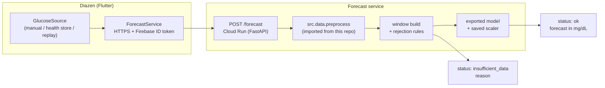

# Deployment design: serving the forecaster to a mobile app

Status: design only. No service has been built. This document records how the model in this
repository would be served to [Diazen](https://github.com/benchohrabdou/Diazen-app), a Flutter/Firebase
diabetes-management app, and — as importantly — what it would refuse to do.

---

## 1. Intended use

A backend forecasting component for a diabetes-management app: given a recent window of continuous
glucose monitor (CGM) readings, return a single predicted glucose value 30 minutes ahead.

It is **not** a medical device, it is **not** clinically validated, and it must not produce dosing
advice. It is trained on 12 patients from one dataset (see the
[limitations](../README.md#5-limitations)), which is far too narrow a basis for clinical claims.

---

## 2. The input requirement, and what it rules out

The served model takes 12 consecutive glucose values on an exact 5-minute grid, along with an
observed/imputed flag per bin. Missing bins are forward-filled for at most 30 minutes, as in training.
Offline evaluation applies four rejection rules; only the three input-side rules carry over to serving,
because at serving time the target lies in the future and there is nothing to check. A request is
declined if:

- there are too few readings to fill the 60-minute window;
- any input bin is still missing after the 30-minute forward-fill limit;
- more than 25% of the input bins were imputed.

That requirement decides the integration:

| Glucose source | Viable? | Notes |
|---|---|---|
| Manual entries typed into the app | **No** | A few readings a day cannot populate a 60-minute grid. The model would be running on inputs unlike anything in training. This is not a degraded mode; it is out of distribution. |
| CGM data via a platform health store (Apple Health, Health Connect) | Yes | The CGM vendor's own app writes readings; the app reads them. Usually the lowest-friction route, subject to platform permissions. |
| CGM vendor developer API | Yes, with caveats | Access terms, approval requirements and data latency vary by vendor and change over time. Some endpoints are delayed by hours, which rules out live forecasting. Must be checked against current vendor documentation. |
| Recorded/synthetic trace (replay) | Demo only | Drives the full pipeline without a live feed. Must be synthetic: the OhioT1DM Data Use Agreement is treated as not permitting republishing the dataset through a service or demo. |

Diazen currently stores manually entered glucose values, so the model cannot serve live users today.
The integration below assumes a CGM source, with a replay source used for demonstration.

### 2.1 Why the glucose-only model is served

The repository has two LSTM variants. The glucose + insulin/carbs variant scores better, but it cannot
be served today. Its inputs include a per-bin **basal** column, built from pump basal rates, temporary
basals and suspensions. Platform health stores generally do not expose pump basal data, so the service
could not construct that column, and feeding the model an empty or guessed basal column would put it
out of distribution.

The served model is therefore the glucose-only LSTM. The cost is small: at 30 minutes the insulin/carbs
variant is 0.47 mg/dL better in mean RMSE across the 12 patients (19.03 vs 18.56 mg/dL), less than the
spread across patients (standard deviation about 2.1 mg/dL). Access to pump basal data would enable the
insulin/carbs variant; see [Open questions](#7-open-questions).

---

## 3. Architecture



The source adapter is the only part that changes when a CGM is added. All three sources emit the same
structure (timestamped glucose readings), so swapping `ManualEntrySource` for `HealthSource` leaves the
service, the contract and the UI untouched.

---

## 4. API contract

```
POST /forecast
Authorization: Bearer <Firebase ID token>

{
  "horizon_min": 30,
  "glucose": [{"ts": "2026-09-24T12:00:00Z", "mgdl": 118}, ...]
}
```

```
200 OK
{
  "status": "ok",
  "mgdl": 143.2,
  "target_ts": "2026-09-24T13:25:00Z",
  "imputed_fraction": 0.08,
  "model_version": "lstm-ph30-seed0",
  "clinical_use": false
}

200 OK
{
  "status": "insufficient_data",
  "reason": "gap_exceeds_30min",       // or too_few_readings | too_many_imputed
  "model_version": "lstm-ph30-seed0"
}
```

Design notes:

- **Declining is a first-class response, not an error.** The input-side rejection rules that protect
  the offline evaluation become production behaviour: when the window is too gappy, the service returns
  no number. A forecast computed from mostly-imputed input would be a guess dressed as a measurement.
- **`model_version` is returned on every response** so a prediction can be traced to a specific
  checkpoint and scaler. The deployed checkpoint is a single seed, while the README reports averages
  over five seeds; the spread across seeds is under 0.15 mg/dL, so a single seed is representative.
- **Timestamps are ISO-8601 UTC.** The training grid is timezone-naive local time; conversion happens
  at the edge, once.
- **No patient identifiers in the payload.** The service is stateless and stores nothing; authorisation
  is a Firebase ID token verified per request.

---

## 5. Keeping training and serving consistent

The single largest risk in this design is that the service's preprocessing drifts away from the
training pipeline — a different rounding rule for binning, a different fill limit, a different scaler —
producing a model that silently sees inputs it was never trained on.

Mitigations, in order of importance:

1. The service **imports `src/data/preprocess.py` and the dataset windowing code from this repository**
   rather than reimplementing them. The repo is a dependency of the service, not a reference for it.
   Two pieces of glue are needed: a small adapter from the API's JSON to the tables `build_grid`
   expects (the tables the XML parser produces offline), and packaging (a `pyproject.toml`) so the
   repository can be installed as a dependency. The principle stands: import, don't reimplement.
2. The scaler is loaded from the same artefact bundle as the model weights, keyed by `model_version`.
3. A consistency test feeds one recorded input through both the offline pipeline and the service and
   asserts the resulting feature tensors are identical.
4. If the model were ever moved on-device, the preprocessing would have to be reimplemented in Dart,
   and this guarantee would be lost. That is the main argument for server-side inference.

---

## 6. What the app shows, and why there is no hypoglycemia alert

The app displays a predicted value with a trend indicator, a visible "research prototype, not clinically
validated" label, and nothing that could be read as a dosing recommendation. When the service returns
`insufficient_data`, the app shows that state plainly rather than falling back to a stale or
extrapolated number.

It does **not** raise low-glucose alerts. That is a measured decision, not caution for its own sake.
As documented in the
[main limitation](../README.md#43-main-limitation-the-point-forecasts-rarely-cross-the-hypoglycemia-threshold)
section, the point forecasts almost never fall below 70 mg/dL: at the 60-minute horizon the models
raise at most about 5 alerts against 841 actual lows (glucose-only 0.2, insulin/carbs 4.8, averaged
over seeds), while the trivial persistence baseline catches 34% of them. At 30 minutes, the served
glucose-only model alerting when the forecast is below 70 has a sensitivity of 0.26 against
persistence's 0.56. A point forecast trained to minimise squared error approximates a conditional mean,
and a conditional mean rarely crosses a threshold that only a minority of outcomes cross.

Alerting would therefore require a different output, not a different threshold on this one:

- a predicted **probability of going below 70**, or a low quantile of the forecast distribution;
- an alert threshold chosen on held-out data and reported as a sensitivity/precision trade-off;
- explicit acceptance of a false-alarm rate, since the threshold sweep shows sensitivity and precision
  moving in opposite directions (at 30 minutes, alerting below 80 mg/dL gives the glucose-only model
  0.75 sensitivity at 0.53 precision).

Until such a model exists, shipping an alert built on this forecast would misrepresent what it can do.

---

## 7. Open questions

- **CGM data access.** Which vendor, which route (health store vs developer API), what latency, and what
  approval process. Live forecasting is impossible with delayed endpoints.
- **Pump basal access, enabling the insulin/carbs variant.** The better-scoring variant needs basal
  rates, temporary basals and suspensions from the insulin pump (Section 2.1).
- **Model distribution.** Whether the OhioT1DM Data Use Agreement places any constraint on distributing
  or serving a model trained on the dataset. To be checked before any public deployment.
- **Regulatory status.** A glucose prediction shown to a patient may fall under medical-device software
  rules depending on jurisdiction and on how the output is presented. A forecast labelled as a prototype
  is not the same as a decision-support feature, and the line is not for this project to assume.
- **Monitoring.** Rejected-window rate as a data-quality signal, forecast distribution versus observed
  distribution as a drift signal, and per-user request volume.
- **Personalisation.** The served model is a population model. Per-patient fine-tuning is listed as
  future work in the README and would change what is deployed per user, and what has to be stored.

---

## 8. Scope of a first demo

The smallest version that demonstrates the whole path: one horizon (30 minutes), one endpoint, the
replay source, deployed to Cloud Run, and a single Flutter screen showing the forecast and the
insufficient-data state. Authentication, batching, the 60-minute model and any alerting logic are out of
scope until that works end to end.
